# Alza — Plans that rise to 3D

A floor-plan studio built for the [WebMCP Challenge](https://webmcp.devpost.com/). You draw
walls, rooms, doors, windows and furniture in a precise 2D editor, or load a photo of a plan
and trace over it, and then raise the whole thing into a 3D model you can walk through.

The twist is that an AI agent can join the same live page through **WebMCP**. It reads the
full metric model, edits the geometry with the same tools the human uses, checks its own
work against a constraint engine, and drives the 3D camera to give tours.

Everything runs client side. No backend, no accounts, plans stay on your machine.

---

## The two-minute film

<p align="center">
  <a href="https://www.youtube.com/watch?v=RihMFcMstvI">
    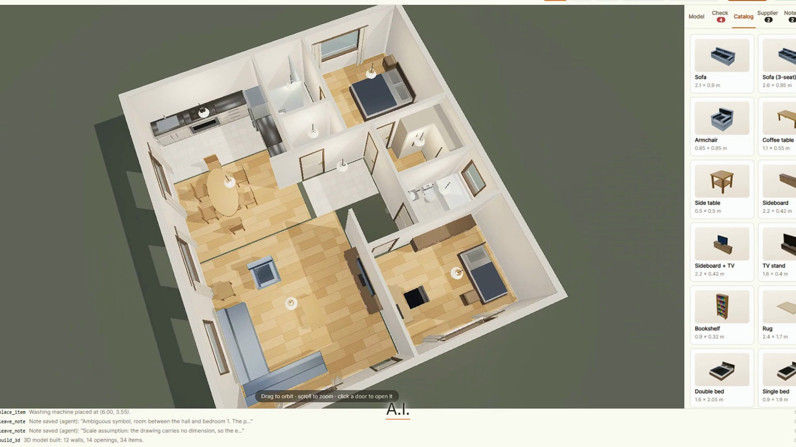
  </a>
</p>

<p align="center"><em>2 min 15 s. The agent gets a photo of a plan, asks for one real
dimension, and draws the whole thing. After that it checks itself, buys a chair from another
origin, gets a destructive call refused by a human, and walks the result.</em></p>

I put the film together with [HyperFrames](https://hyperframes.heygen.com/) from a
storyboard, a script and HTML compositions. That authoring tree is not carried here; the
finished film is on YouTube and its stills are in [`shots/showcase/`](shots/showcase/).

What *is* here is the part you need to reproduce what the film shows:
[`trace.mjs`](trace.mjs) holds the demo plan as data, and [`record6.mjs`](record6.mjs)
drives the real app through the eight beats while ffmpeg captures the screen at 60 fps.

## What it looks like

The plan below was traced by the agent from a photo of a drawing it had never seen. Every
coordinate came out of tool calls. Nothing was placed by hand.

<p align="center">
  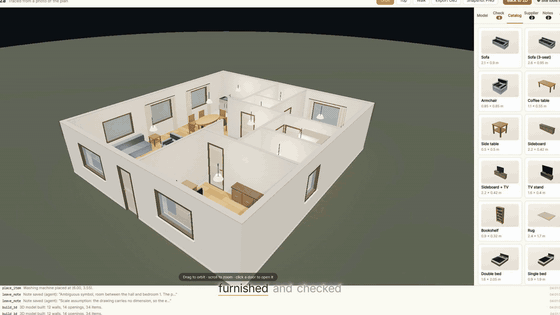
</p>

<p align="center">
  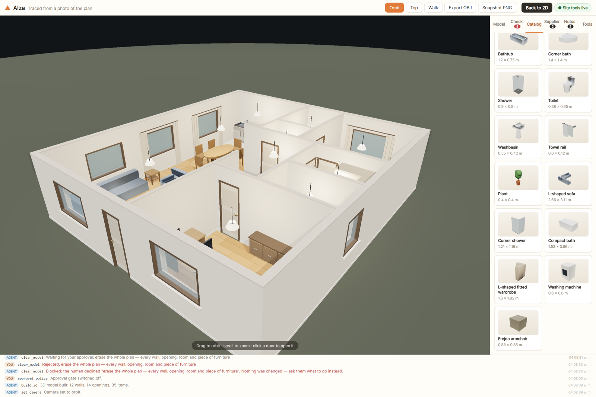
</p>

The proof in one image. The drawing underneath is the source photo; the dark geometry on top
is what Alza built from it. The agent asked for a single real dimension, set the scale from
that, and traced the rest.

<p align="center">
  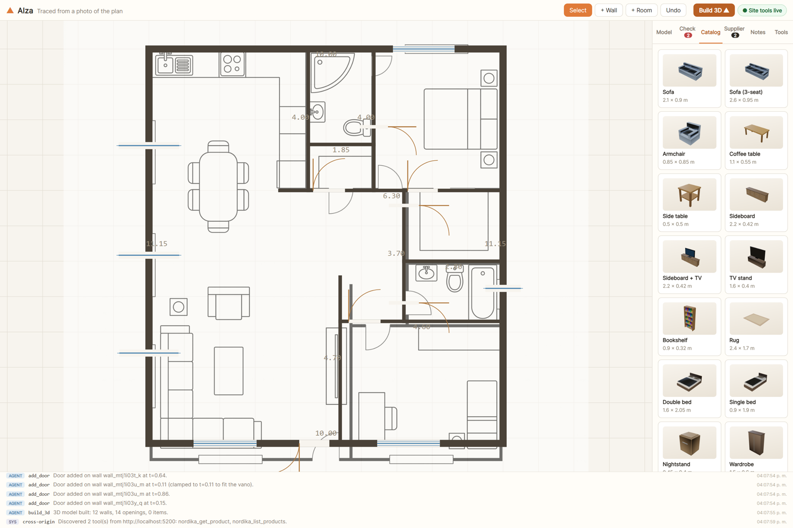
</p>

| | |
|:--:|:--:|
| 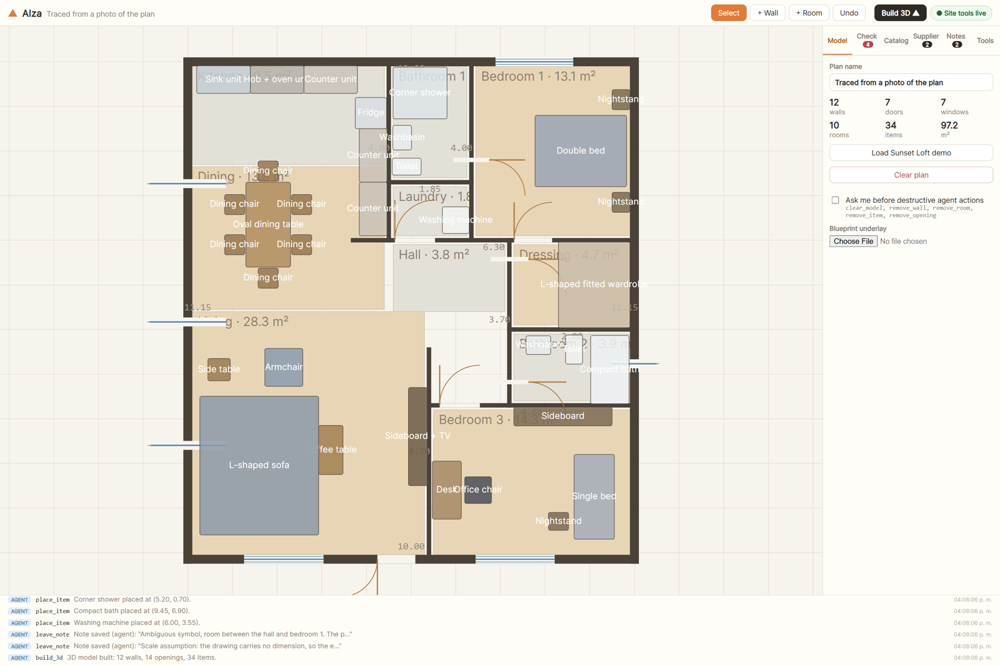 | 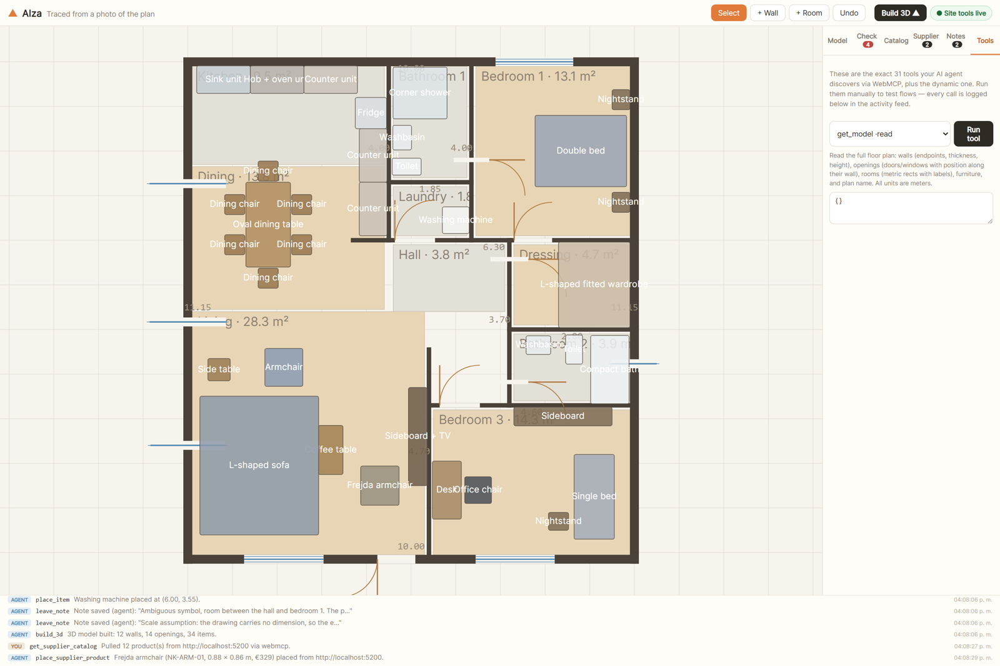 |
| The finished plan: 12 walls, 14 openings, 10 rooms, 34 pieces, with live areas per room. | The tools, published by the page itself. No server and no key, just `document.modelContext.registerTool`. |
|  | 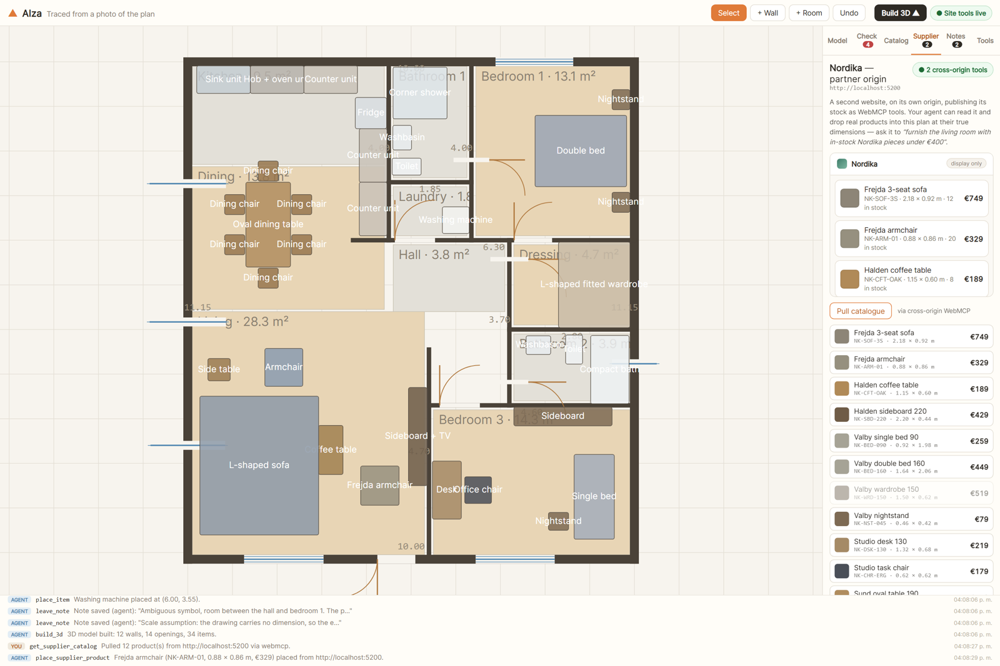 |
| A furniture shop on its own origin publishes its own tools and shares them with this page. | One instruction crosses that boundary, and a real product lands in the plan at its real size. |
| 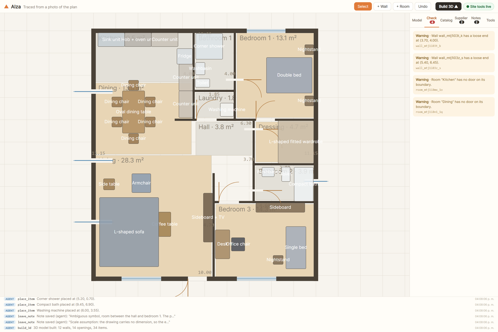 | 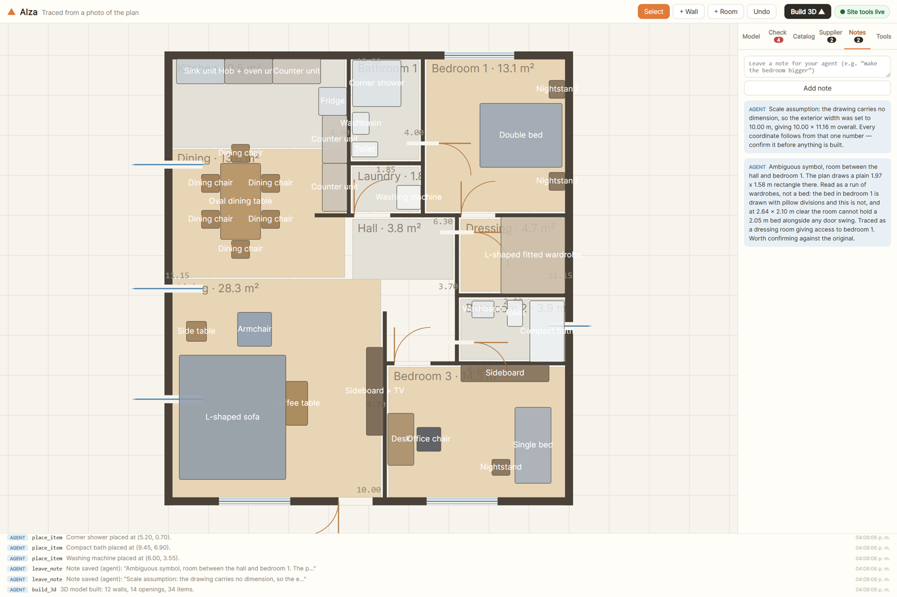 |
| It checks its own work: overlaps, wall crossings and blocked door swings, reported in metres. | When it cannot know something, it says so. Here it flags an ambiguous symbol and its scale assumption. |
| 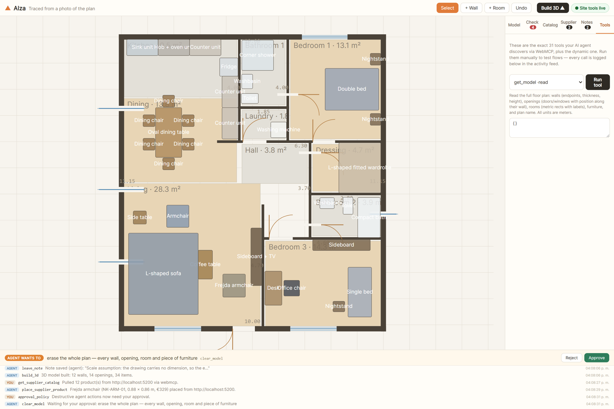 | 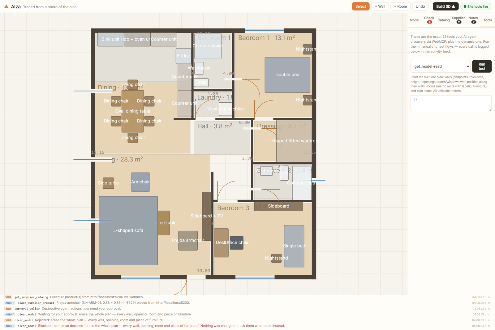 |
| The human keeps the veto: a destructive call parks on the page until a person decides. | The refusal comes back as words the agent can act on, not a silent failure. |
| 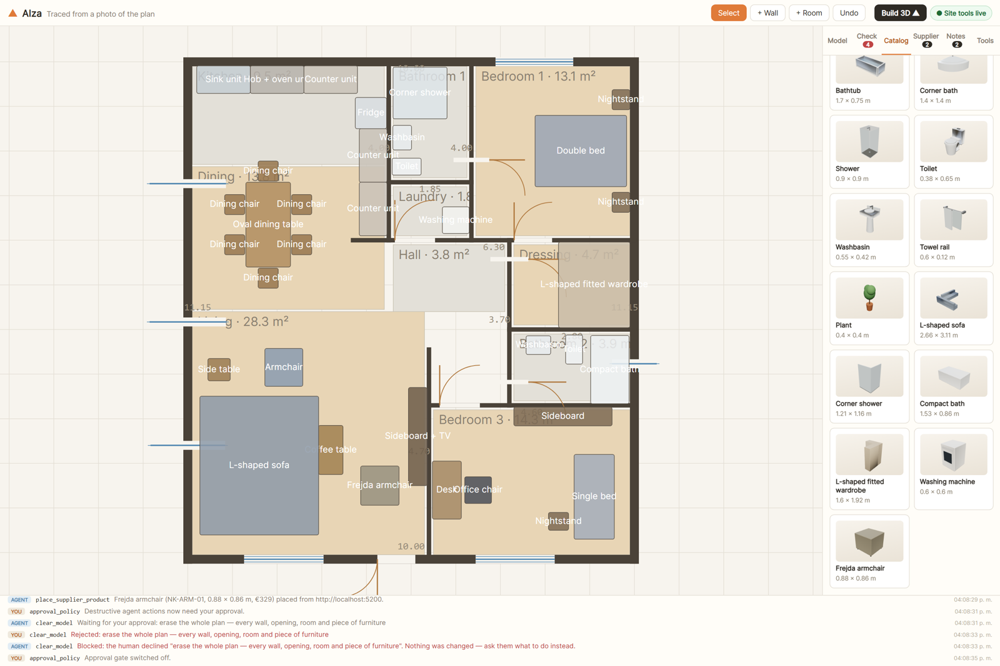 | 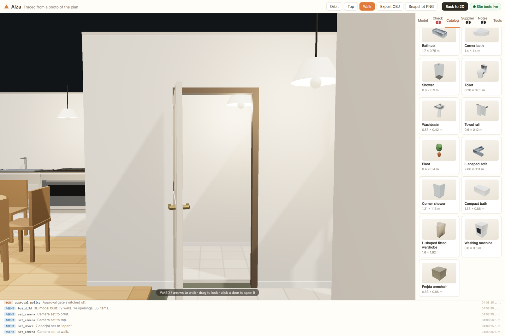 |
| When the catalogue has no honest match, the agent models the piece itself: an L-shaped sofa, a corner shower, a compact bath, a fitted L wardrobe, a washing machine. | Then you walk it, at 1.6 m eye height, doors open, collision on. |

More stills in [`shots/showcase/`](shots/showcase/).

## Try it in 2 minutes

1. Open the live app (link at the top of this repo).
2. **In ChatGPT desktop:** open the URL in the in-app browser. WebMCP works out of the box.
   **In Google Chrome 149+:** enable `chrome://flags/#enable-webmcp-testing` and restart.
   The pill in the header turns green: **● Site tools live** (31 tools registered).
3. Ask your agent, for example:
   - *"Add a 3 × 2.5 m study next to the bedroom, with a door and a window."*
   - *"The sofa placement feels off. Check the plan and fix any issues."*
   - *"Build the 3D and give me a walkthrough."*
4. No WebMCP runtime? The app is still complete. Open the **Tools** tab and run the exact
   same 32 tools manually; every call is logged in the activity feed at the bottom.

## Trace your own plan with the agent

Have a floor-plan image (scan, photo, PDF export)? Let the agent rebuild it in 3D:

1. Upload the image in **sidebar → Model → Blueprint underlay** (it appears on the 2D
   canvas), and attach the same image in the chat so the agent can see it.
2. Give the agent **one real dimension** from the plan, e.g. *"this wall is 4.6 m"*.
   It calls `calibrate_underlay` with two points on the image and that distance, and the
   blueprint is scaled to true meters.
3. Ask: *"Trace this plan: walls, doors, windows, rooms, then furnish it and check for
   issues."* The agent draws over the underlay with `add_wall` / `add_door` / `add_window`,
   verifies with `measure` + `get_issues`, fixes what it got wrong, and finishes with
   `build_3d`.
4. Correct anything by hand. You and the agent share the same model.

## Why WebMCP is the point

Canvas geometry is exactly where agent actuation falls over. You cannot click-and-drag a
wall reliably, and there is no DOM to scrape. So Alza publishes the plan as **structured
tools** via `document.modelContext.registerTool`, and those tools call the same store
actions the UI buttons call. Human and agent end up co-editing one model on one live page.

```js
document.modelContext.registerTool({
  name: "add_wall",
  description: "Add a wall segment from (ax,ay) to (bx,by) in meters…",
  inputSchema: { /* … */ },
  execute: async (input) => { /* the same action the + Wall button uses */ },
});
```

## The 31 tools (+ 1 dynamic)

| Group | Tools |
|---|---|
| **Read** (readOnly) | `get_model` · `get_issues` · `get_item_catalog` · `get_editor_state` · `measure` · `get_underlay` |
| **Blueprint** | `calibrate_underlay`, scales the uploaded plan image to real meters from one known dimension |
| **Structure** | `add_wall` · `edit_wall` · `remove_wall` |
| **Openings** | `add_door` · `add_window` · `move_opening` · `remove_opening` · `set_door_swing` (hinge side + swing direction) |
| **Rooms** | `add_room` · `update_room` · `remove_room` |
| **Furniture** | `place_item` · `move_item` · `remove_item` · `define_item_kind`, model a piece the catalogue lacks, from primitives |
| **Model & view** | `set_plan_name` · `clear_model` · `build_3d` · `set_camera` (orbit/top/walk) · `set_doors` (swing the leaves open/shut) |
| **Cross-origin** | `get_supplier_catalog` · `place_supplier_product`, read a **partner origin's** own WebMCP tools and drop its real products into the plan |
| **Collaboration** | `leave_note` · `get_notes` |
| **Dynamic** | `extend_selected_wall`, published **only while the human has a wall selected** (registered/unregistered live, per the spec's `toolchange` cycle). The human points, the agent acts on exactly that wall. |

A few design notes:

- One store, two users. A vanilla zustand store powers both the React UI and the WebMCP
  tools, so actions, validation and undo history are identical for both.
- Every tool call, human or agent, is logged to an on-page activity feed with source
  badges. The spec asks that tools run visibly on the page; this is that.
- `readOnlyHint` / `destructiveHint` / `untrustedContentHint` annotations help the agent
  plan, and every tool carries a `title` next to its `name`.
- Tools are registered with `registerTool(descriptor, { signal, exposedTo })` and retired
  by **aborting that signal**, which is the spec's unregistration path and what makes the
  runtime emit `toolchange`.
- `get_issues` runs a geometry constraint engine (below). Agents call it after editing
  and fix their own mistakes, which is the self-repair loop.
- Without a WebMCP runtime the app loses nothing. The built-in ToolRunner executes the
  same tools manually.

## Two things WebMCP makes possible that I had not seen elsewhere

### 1. The human approves what the agent destroys

The explainer lists per-call user confirmation as an **open question** ("a way for a tool
to prompt the user for confirmation"). Alza answers it on the page. A tool annotated
`destructiveHint` does not run when the agent calls it; it becomes a **request bar** at
the bottom of the studio (*"AGENT WANTS TO erase the whole plan"*) and the agent's
`execute()` stays pending until a human presses Approve or Reject. Reject returns a real
failure the agent can act on ("the human declined … ask them what to do instead"), and the
`AbortSignal` WebMCP passes to `execute()` releases the request if the agent gives up
first.

The gate is a toggle in **sidebar → Model**. It also guards the manual ToolRunner, because
both paths run through the same wrapper.

### 2. One agent, two origins, one plan

**Nordika** is a separate website on its own origin (`partner/`). It knows nothing about
Alza. It publishes its stock as its own WebMCP tools (`nordika_list_products`,
`nordika_get_product`) and shares them with the studio using
`registerTool(descriptor, { exposedTo })`.

Alza embeds it in an iframe carrying **`allow="tools"`** (the `tools` Permissions Policy),
discovers those tools with **`getTools({ fromOrigins })`** and calls them with
**`executeTool()`**. So an agent standing on one page composes two origins: it reads a
supplier's real catalogue and lays those products into the plan at their true dimensions,
where the constraint engine judges them like anything else. *"Furnish the living room with
in-stock Nordika pieces under €400"* is a single instruction that crosses a security
boundary with no server in the middle. The browser is the integration layer.

Where a runtime has no cross-origin support, the same two calls run over `postMessage`,
and the UI says which transport was used.

## The constraint engine (`get_issues`)

Metric precision is the product. The checker validates:

- **Walls:** too short, loose ends (T-junctions count as connected), collinear overlaps
  (total or partial), mid-span crossings.
- **Openings:** vano fully inside its wall (creation-time clamping + detection), overlapping
  openings, sill + height above wall height, and **a wall ending inside another wall's
  opening**.
- **Rooms:** floating, overlapping, doorless, too small.
- **Furniture:** oriented-rectangle **SAT** against walls (leaning is legal, crossing is an
  error), blocking door swing paths and window light (with a sill-height nuance),
  item-vs-item collisions (rugs exempt), items outside every room.

The bundled **Sunset Loft** demo is audited to **0 issues** and kept that way by a
regression test.

## Architecture

```
src/
  model/    types.ts · geometry.ts (snap, SAT, segment math) · issues.ts (checker)
            catalog.ts (31 furniture kinds + runtime entries) · store.ts (shared actions, undo, activity) · seed.ts
  editor/   Editor.tsx — SVG: chained walls, rooms, openings with door arcs,
            furniture drag, blueprint underlay, metric dimensions, 5 cm snap, pan/zoom
  three/    build.ts (extrusion with real openings, resolved joints, floors)
            furniture.ts (composite pieces + generic builder for imported products) · Scene3D.tsx (orbit/top/walk + WASD,
            click-to-place, OBJ/PNG export) · exportBus.ts
  mcp/      registry.ts (registration + uniform logging) · tools.ts (31 + 1 dynamic)
            bootstrap.ts (runtime detection, dynamic tool lifecycle, toolchange)
  ui/       App · Sidebar (Model/Check/Catalog/Supplier/Notes/Tools) · ToolRunner
            ActivityFeed · ApprovalBar (human-in-the-loop gate) · SupplierPanel (cross-origin)
tests/      geometry + issues suites (30 tests, incl. seed = 0 issues regression)
e2e-full.mjs  Playwright: drives the real app in Chromium with --enable-features=WebMCP,
            runs every tool, asserts zero console errors — 56 checks
            (2 skip on Chrome builds without navigator.modelContextTesting)
trace.mjs   the demo plan as data: walls, openings, rooms, furniture, and the kinds the
            agent defines for itself. Shared by the video and the screenshot gallery.
record6.mjs records the film's eight beats as real 60 fps screen capture (ffmpeg ddagrab)
shots.mjs   rebuilds the screenshot gallery from trace.mjs
serve-local.mjs  serves dist/ on two origins with the production headers, for local demos
```

Stack: Vite 7 · React 19 · TypeScript (strict) · zustand · Three.js (ACES tone mapping,
PCF soft shadows) · SVG 2D · vitest · Playwright. Deploys as a fully static site.

## Develop

```bash
npm install
npm run dev        # the studio            → http://localhost:5199
npm run partner    # the partner origin    → http://localhost:5200   (second terminal)
npm test           # 30 unit tests
npm run build      # production build — two entry points: the studio and partner/
node e2e-full.mjs  # 56-check Playwright battery (run both servers first)
```

The partner catalogue is a separate origin on purpose; that is the whole point of the
cross-origin tool exchange. A different port is a different origin, so `localhost:5200` is
all you need locally. In production, deploy `dist/partner/` to its own host or subdomain
and pass it with `?supplier=https://…`. Without it, everything else in the app still works.

## License

MIT — see [LICENSE](./LICENSE).
